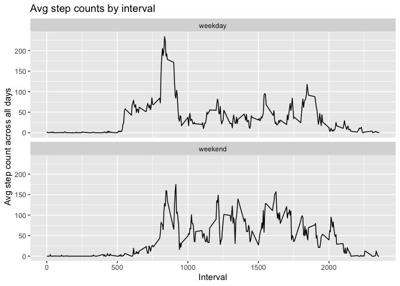

## Loading and preprocessing the data
First load some dependencies.

```r
library(ggplot2)
library(dplyr)
```

```
## 
## Attaching package: 'dplyr'
```

```
## The following objects are masked from 'package:stats':
## 
##     filter, lag
```

```
## The following objects are masked from 'package:base':
## 
##     intersect, setdiff, setequal, union
```

We will unzip and load the activity data into a dataframe.


```r
if (!file.exists("activity.csv")) { 
  unzip(filename)
}
activity_data <- read.csv("activity.csv")
```

Let's see how big the data is.

```r
dim(activity_data)
```

```
## [1] 17568     3
```

Let's also take a look at what sort of the data looks like:

```r
head(activity_data)
```

```
##   steps       date interval
## 1    NA 2012-10-01        0
## 2    NA 2012-10-01        5
## 3    NA 2012-10-01       10
## 4    NA 2012-10-01       15
## 5    NA 2012-10-01       20
## 6    NA 2012-10-01       25
```

We can see that the date is in the format `yyyy-mm-dd`, so let's convert the `date` column to date objects.


```r
activity_data$datetime <- as.POSIXct(activity_data$date, format="%Y-%m-%d")
```

## What is mean total number of steps taken per day?

From the sample data rows above, we can see that some of the `steps` data may be not available, 
so let's instead make sure we run calculations only with data that has both the `steps` and `date` data available.

First let's see how many rows there are like this anyway, as a percentage of the total.

```r
na_rows <- sum(is.na(activity_data$steps) | is.na(activity_data$date))
na_rows / dim(activity_data)[1]
```

```
## [1] 0.1311475
```

That is a noticeable chunk, but leaves us enough to work with still.

Let's create another copy of the data frame that doesn't include the NAs.

```r
no_na_activity <- activity_data[!(is.na(activity_data$steps) | is.na(activity_data$date)), ]
```

Calculate the total number of steps taken per day.

```r
total_steps_by_day <- aggregate(no_na_activity$steps ~ no_na_activity$datetime, FUN=sum)
names(total_steps_by_day) <- c("date", "steps")
```

Make a histogram of the total number of steps taken each day.

```r
ggplot(total_steps_by_day, aes(x=steps)) + 
  geom_histogram(binwidth = 2000) +
  labs(title="Histogram of total number of steps in a day")
```

<!-- -->

Calculate and report the mean and median of the total number of steps taken per day.

```r
# Mean
mean(total_steps_by_day$steps)
```

```
## [1] 10766.19
```

```r
# Median
median(total_steps_by_day$steps)
```

```
## [1] 10765
```

## What is the average daily activity pattern?

Make a time series plot (i.e. type="l") of the 5-minute interval (x-axis) and the average number of steps taken, 
averaged across all days (y-axis).


```r
avg_steps_per_interval <- aggregate(no_na_activity$steps ~ no_na_activity$interval, FUN=mean)
names(avg_steps_per_interval) <- c("interval", "steps")

ggplot(avg_steps_per_interval, aes(interval, steps)) + 
  geom_line() + 
  labs(x="Interval", y="Avg step count across all days") + 
  labs(title="Avg step counts by interval")
```

<!-- -->

Which 5-minute interval, on average across all the days in the dataset, contains the maximum number of steps?

```r
avg_steps_per_interval[which.max(avg_steps_per_interval$steps), ]$interval
```

```
## [1] 835
```

## Imputing missing values

Note that there are a number of days/intervals where there are missing values (coded as NA). The presence of missing days may introduce bias into some calculations or summaries of the data.

Calculate and report the total number of missing values in the dataset (i.e. the total number of rows with NAs).

```r
sum(is.na(activity_data$steps))
```

```
## [1] 2304
```

Devise a strategy for filling in all of the missing values in the dataset. 
I will use the strategy of filling in missing values with the mean steps value for that interval.

Create a new dataset that is equal to the original dataset but with the missing data filled in.

```r
imputed <- activity_data

# Fill in the missing data
merged <- merge(imputed, avg_steps_per_interval, by=c("interval"))
merged <- merged %>% mutate(steps = ifelse(is.na(steps.x), steps.y, steps.x))
```

Calculate the total number of steps taken per day.

```r
imputed_total_steps_by_day <- aggregate(merged$steps ~ merged$datetime, FUN=sum)
names(imputed_total_steps_by_day) <- c("date", "steps")
```

Make a histogram of the total number of steps taken each day.

```r
ggplot(imputed_total_steps_by_day, aes(x=steps)) + 
  geom_histogram(binwidth = 2000) +
  labs(title="Histogram of total number of steps in a day after filling in empty values")
```

<!-- -->

Calculate and report the mean and median of the total number of steps taken per day.

```r
# Mean
mean(imputed_total_steps_by_day$steps)
```

```
## [1] 10766.19
```

```r
# Median
median(imputed_total_steps_by_day$steps)
```

```
## [1] 10766.19
```

Do these values differ from the estimates from the first part of the assignment? What is the impact of imputing missing data on the estimates of the total daily number of steps?

These values are more or less the same as the initial part of the assignment. This is unsurprising, since we used mean step values to fill in empty ones that were likely near the overall daily mean/median.

## Are there differences in activity patterns between weekdays and weekends?

Create a new factor variable in the dataset with two levels – “weekday” and “weekend” indicating whether a given date is a weekday or weekend day.


```r
activity_data$dayofweektype <- as.factor(ifelse(weekdays(activity_data$datetime) %in% c("Saturday", "Sunday"), "weekend", "weekday"))
```

Make a panel plot containing a time series plot (i.e. type="l") of the 5-minute interval (x-axis) and the average number of steps taken, averaged across all weekday days or weekend days (y-axis). 


```r
avg_steps_per_interval_by_day_type <- with(activity_data, aggregate(steps ~ interval + dayofweektype, FUN=mean))

ggplot(avg_steps_per_interval_by_day_type, aes(interval, steps)) + 
  geom_line() + 
  facet_wrap(. ~ dayofweektype, nrow=2, ncol=1) +
  labs(x="Interval", y="Avg step count across all days") + 
  labs(title="Avg step counts by interval")
```

<!-- -->


